# 1. Creating Your First Agent in Snowflake: Step-by-Step Guide

This guide will walk you through setting up your first custom agent in Snowflake, using the Tavily Web Search tool as an example. The process includes configuring roles, secrets, network access, and deploying a Python-based stored procedure.

---

---

## Prerequisites

- Create a free [`Snowflake`](https://signup.snowflake.com/) account. Make sure you select: **Enterprise**, **AWS** & **US West Oregon**

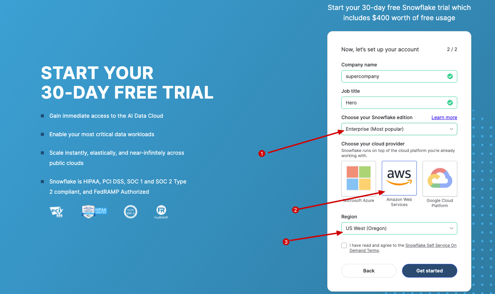

- Create a free [`Tavily`](https://www.tavily.com/) account.

---

## Visual Guide

### Step 1: You can follow the steps visually using the image(s) below.

- After you create a [`Snowflake`](https://signup.snowflake.com/) account and [`Tavily`](https://www.tavily.com/) account, sign in to the Tavily web interface and generate a new API Token

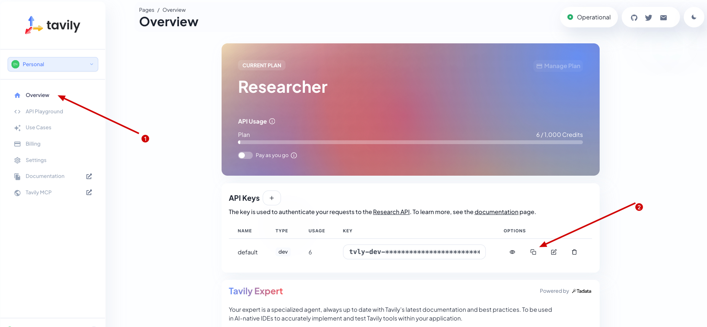

- Sign in to the Snowflake web interface and create a new Workspace (or select an existing Workspace) before proceeding.

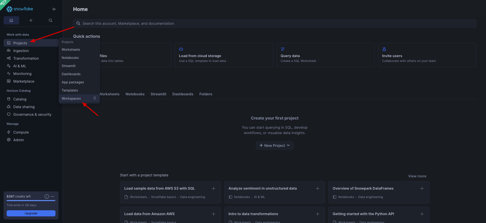

- Once inside the Workspace, copy the setup script in [`ai/src/tavily-setup.sql`](src/tavily-setup.sql) and paste it the the Workspace. **Make sure you replace the Token with your actual Token**.

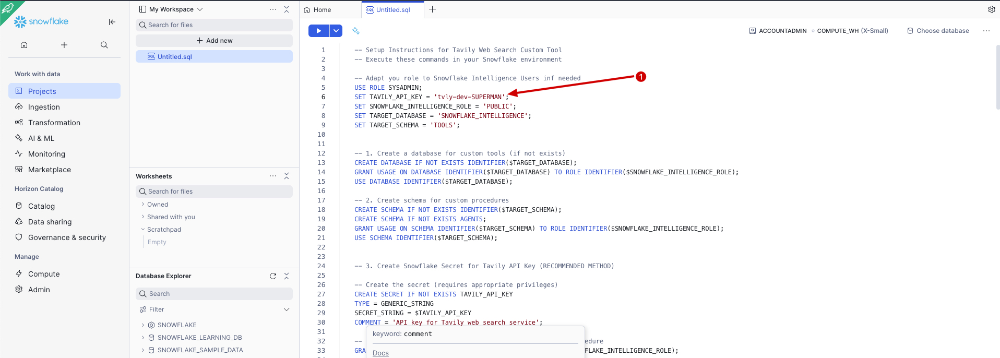

- **Run the script**

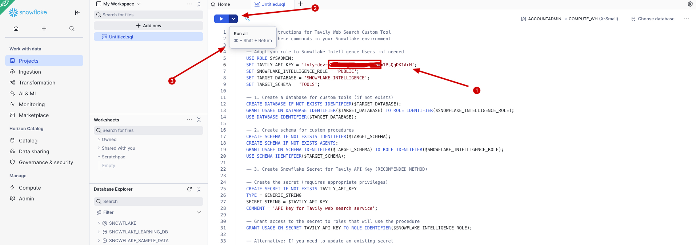

- After running the script you should see a result set popping up, basically a Stored Procedure was created that use the service to take the prompt and search latest results.

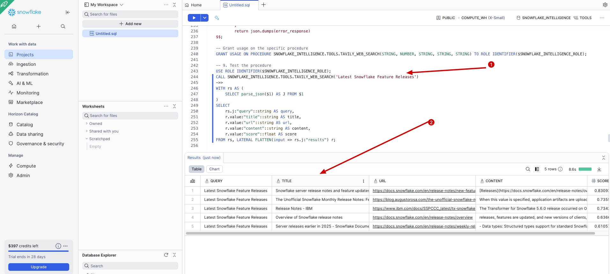

- Once this is sucessful you can create a new agent Navigate to **AI & ML** > **Agents**, . **IMPORTANT** If you get an error logout and log back in.

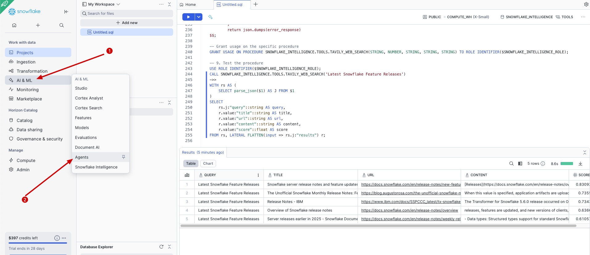

- Make sure you use the correct Dabases (SNOWFLAKE_INTELLIGENCE) and the Schema (AGENTS), name your Agent (LOOKER).

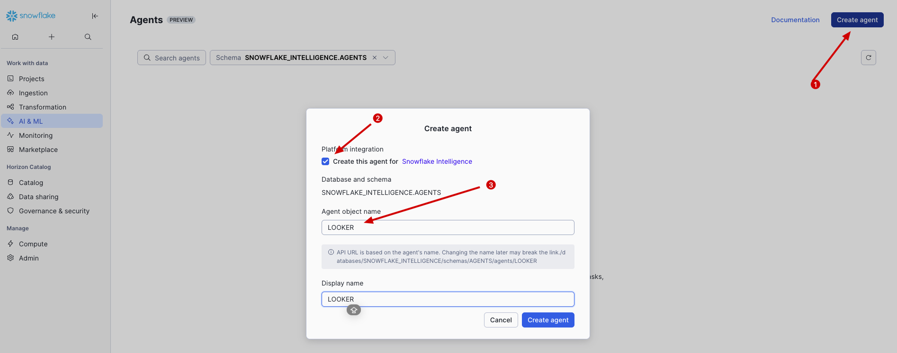

### Step 2: Edit the Snowflake Intelligence Agent

- Select the agent (LOOKER) to enhance, Click **Edit**

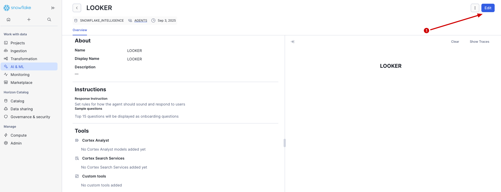

- Go to the **Tools** section, find **Custom tools** and click **+ Add**

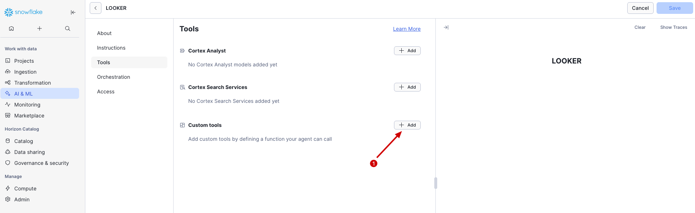

1. Configure the custom tool:
   - **Name**: `TavilyWebSearch`
   - **Resource Type**: `Procedure`
   - **Database & Schema**: `SNOWFLAKE_INTELLIGENCE.TOOLS`
   - **exclude_domains**: Description
    ```
    Comma-separated list of specific domains to search within. Use when you want results
    only from trusted or specific sources. Examples: "reuters.com,bbc.com" for news,
    "github.com,stackoverflow.com" for technical content, "sec.gov,investor.gov" for 
    financial data. Set to empty String ('') for general web search across all domains.
    ```
   - **include_domains**: Description
    ```
    Comma-separated list of specific domains to search within. Use when you want results
    only from trusted or specific sources. Examples: "reuters.com,bbc.com" for news,
    "github.com,stackoverflow.com" for technical content, "sec.gov,investor.gov" for 
    financial data. Set to empty String ('') for general web search across all domains.
    ```
   - **max_results**: Description
    ```
    Maximum number of search results to return (1-10). Fewer results = faster response and
    lower token usage. More results = broader information coverage. Recommended: 3-5 for 
    focused queries, 5-10 for comprehensive research. The function automatically limits to 
    prevent oversized responses that exceed Snowflake's return size limits.
    ```
   - **search_depth**: Description
    ```
    Controls the depth and comprehensiveness of the search. Options are 'basic' and 'advanced'.
    'basic' provides faster searches suitable for quick information retrieval, while 'advanced'
    performs more thorough searches better suited for comprehensive research. Advanced searches
    may take longer but provide more detailed and extensive results.
    ```
   - **search_query**: Description
    ```
    The search terms or question to search for on the web. Should be a clear, specific query
    that describes the information you need. Examples: "latest Tesla stock price", 
    "COVID-19 vaccination rates 2024", "current weather in New York", "recent AI breakthroughs".
    Best practices: Use specific keywords, include relevant context, avoid overly broad terms.
    ```
   - **Warehouse**: COMPUTE_WH
   - **Query Timeout (Seconds)**: 180
   - **Click on ADD**
   - **Click on SAVE**

- Go to Snowflake SNOWFLAKE INTELLIGENCE and add a prompt for instance
    ```
    Latest News about Snowflake, September 2025
    ```

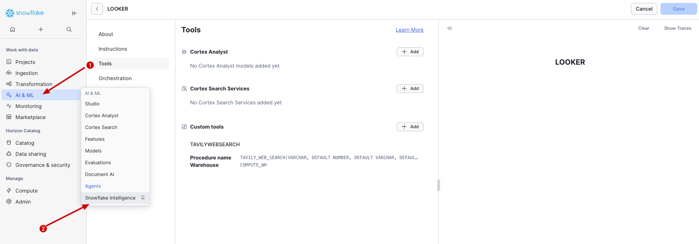
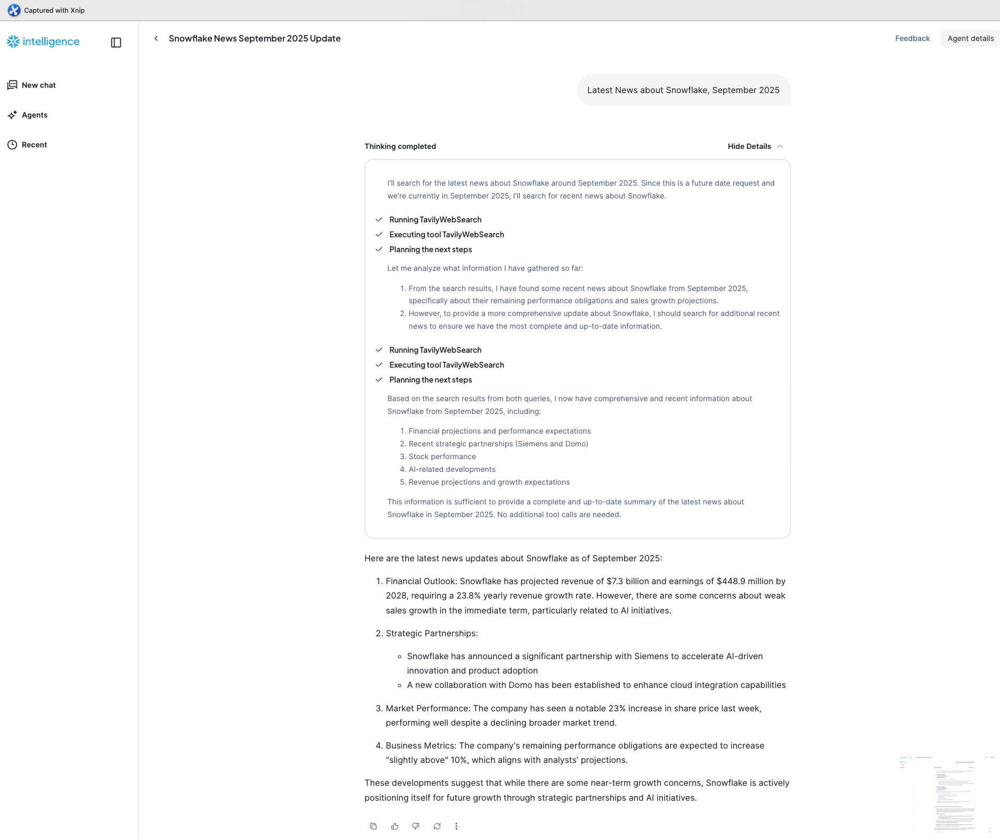

---

# 2. Run Your First AI SQL code on Snowflake: Step-by-Step Guide

This guide will walk you through setting up your first AISQL in Snowflake, using a
Jupyter Notebook, you will create a Snowflake Stage where you will stored some images, and then you will learn how to work with unstructure data.

---
## Visual Guide

### Step 1: You can follow the steps visually using the image(s) below.
- Sign in to the Snowflake web interface and create a new Snowflake Stage with
Server-side encryption named `FOODIMAGES`. Select the databases `SNOWFLAKE_INTELLIGENCE` & schema `PUBLIC` we already created
for the agent `SNOWFLAKE_INTELLIGENCE.PUBLIC`. 
**IMPORTANT** Make sure you enable `Server-side Encryption`.

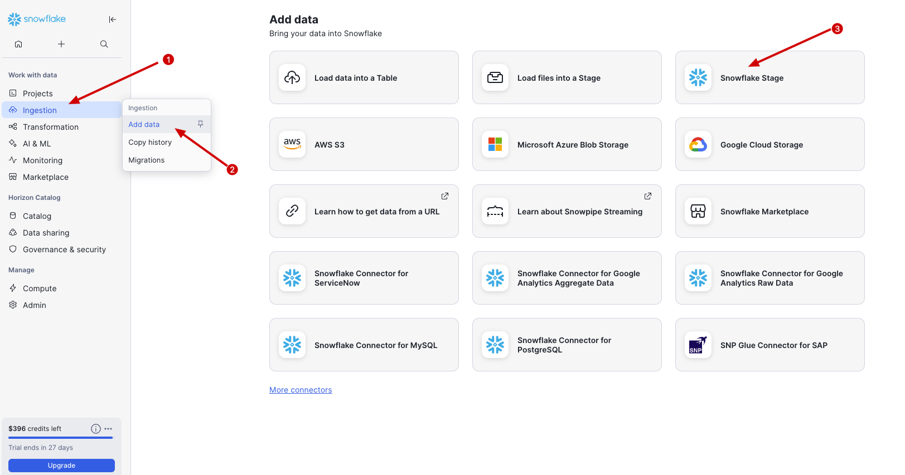

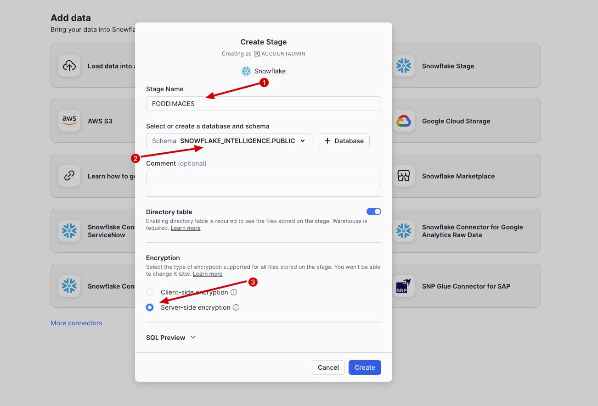

- Donwload and unzip the file with FOODIMAGES [`ai/src/foodimg.zip`](src/foodimg.zip)

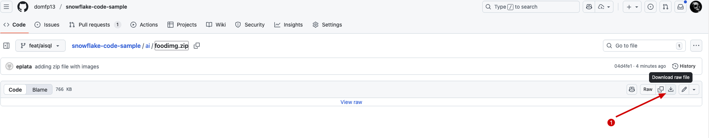

- Donwload the snowbooks_extra.py file [`ai/snowbooks_extras.py`](snowbooks_extras.py)

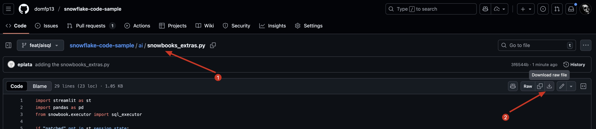

- Download the Jupyter Notebook [`ai/AISQL-Rest.ipynb`](AISQL-Rest.ipynb)

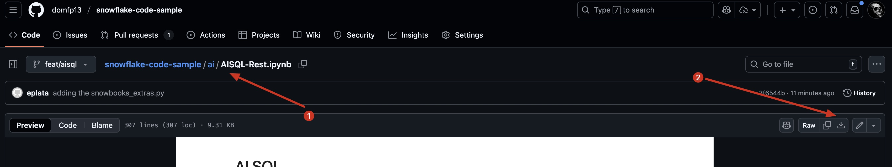

- Upload the images to the Stage `FOODIMAGES`, Select ALL images and upload them.

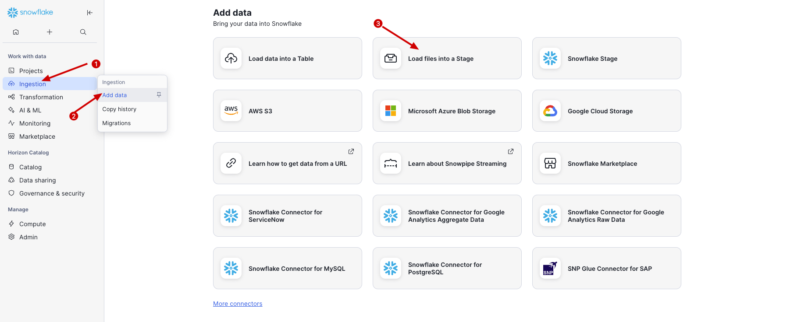

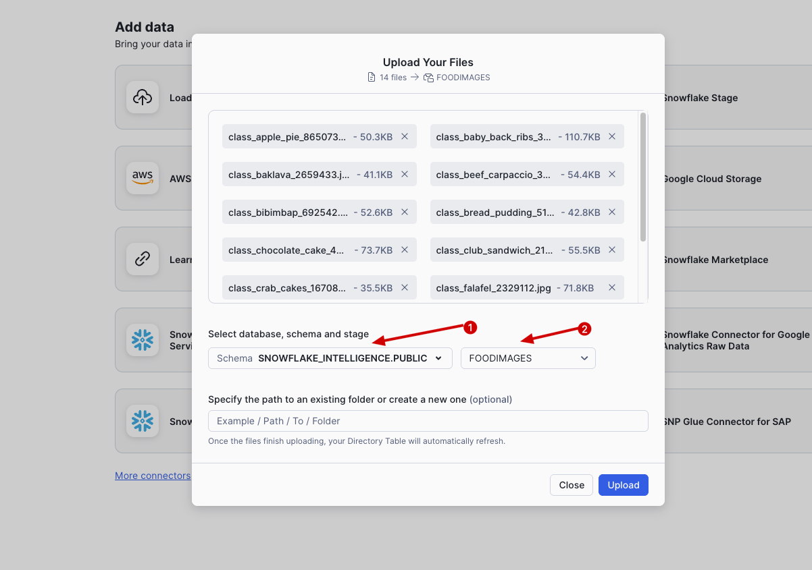

- Create a new notebook (We are going to import the notebook we downloaded before) !!!IMPORTANT!!! make sure you IMPORT the notebook.
DATABASE: SNOWFLAKE_INTELLIGENCE & SCHEMA: PUBLIC

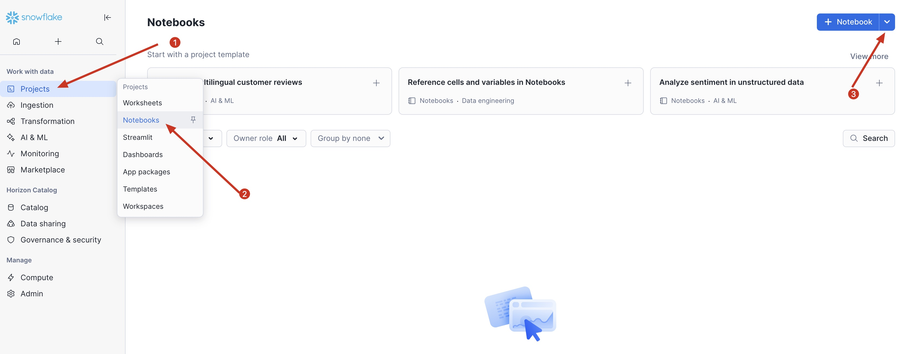
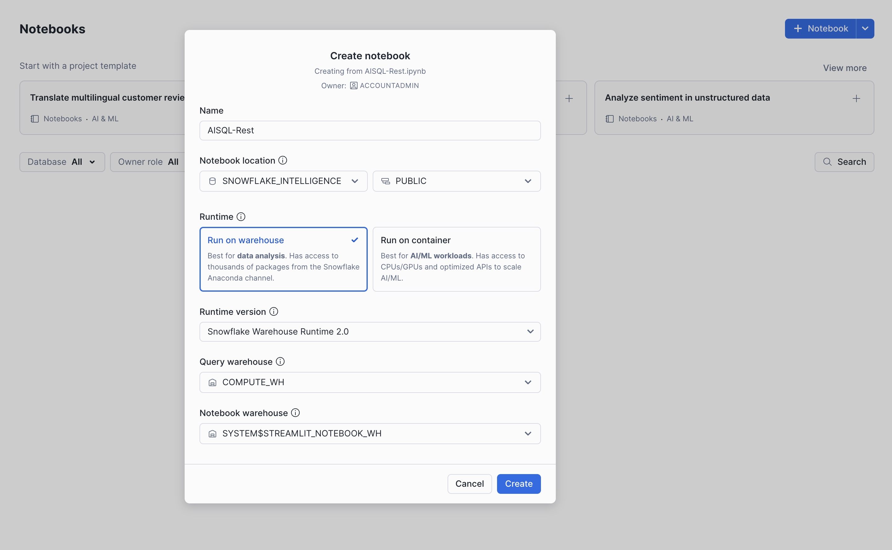

- The last step is to upload our python code (`snowbooks_extras.py`), this allows users to upload their own python code to notebooks.

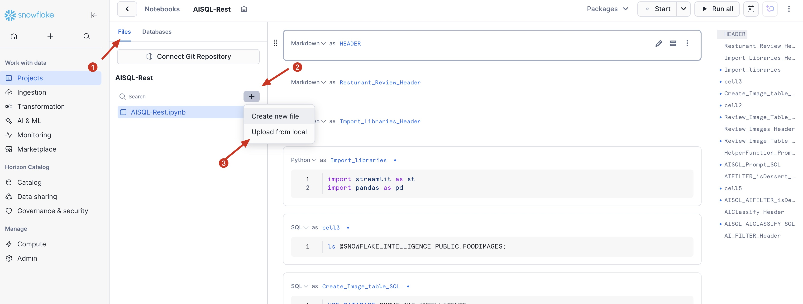


## References
- [Snowflake External Functions Documentation](https://docs.snowflake.com/en/developer-guide/external-functions/intro)

---

Congratulations! You have created your first agent in Snowflake.
